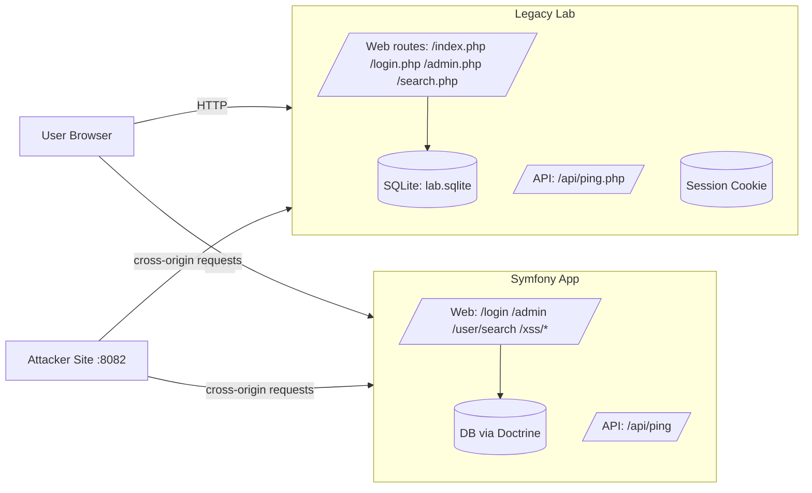

# Threat Model (W2D1)

## Scope
- Legacy Lab (localhost:8081)
- Symfony app (localhost:8000 or symfony server)
- Attacker demo pages (localhost:8082)

## System model (DFD)

## Assets
- User credentials (Legacy + Symfony)
- Session cookies / session state
- Admin-only actions (Legacy: /admin.php, Symfony: /admin)
- User data (user table; admin flags/roles)
- Admin notes content (stored content rendered to users)

## Threat actors
- External attacker (no account)
- Malicious website (CSRF / CORS / browser-based attacks)
- Authenticated user attempting privilege escalation
- Automated scripts (bruteforce, enumeration)

## Entry points / attack surface

### Legacy Lab:
- GET /login.php, POST /login.php
- POST /admin.php (state change)
- GET /search.php?q=
- POST /api/ping.php (CORS-sensitive)

### Symfony:
- POST /login
- /admin (access control)
- GET /user/search?q=&limit=
- /xss/unsafe and /xss/safe
- POST /api/ping

## Assumptions
- Legacy Lab is local-only training code.
- Attackers can fully control request inputs (query params, form body, headers like Origin).
- Browser enforces SOP/CORS; server must still enforce auth/authz for sensitive actions.

## Threats (STRIDE) and mitigations (selected)

### Spoofing
- Threat: credential stuffing / brute-force login.
- Mitigations: rate limiting, strong hashing, MFA (future), lockout policies.

### Tampering
- Threat: CSRF on admin action (Legacy /admin.php).
- Mitigations: CSRF token validation + per-form token rotation + SameSite cookies.

### Repudiation
- Threat: no audit trail for admin actions.
- Mitigations: structured logs + correlation IDs (W2D2).

### Information Disclosure
- Threat: SQLi on user search (Legacy /search.php) reveals users/admin flag.
- Mitigations: prepared statements + safe LIMIT handling; avoid leaking raw DB errors.

- Threat: Stored XSS via admin notes renders attacker JS.
- Mitigations: output encoding (escape-by-default), no raw HTML.

### Denial of Service
- Threat: expensive search payloads / unbounded result size.
- Mitigations: clamp limit, indexing, timeouts.

### Elevation of Privilege
- Threat: bypass admin-only access control (future: IDOR/BAC in W2D4).
- Mitigations: server-side authorization checks, deny-by-default routing.

## Abuse cases (10)

1. As a malicious website, I can trigger POST /admin.php to change the admin note when CSRF is off.
2. As an attacker, I can store `<script>` in admin notes and execute it for every visitor when XSS protection is off.
3. As an attacker, I can use SQLi in /search.php?q=... to enumerate all users when SQLi protection is off.
4. As a malicious website, I can read API responses cross-origin if CORS reflects Origin and allows credentials.
5. As an attacker, I can probe admin-only routes and confirm existence via 403/200 differences.
6. As an attacker, I can force very large limit values to stress DB if limits aren’t clamped.
7. As an attacker, I can exploit verbose DB errors to learn schema/table names.
8. As an attacker, I can attempt session fixation if session IDs are accepted from untrusted sources.
9. As an attacker, I can attempt to bypass access control with direct URL access to /admin.php.
10. As an attacker, I can attempt to replay CSRF tokens if tokens are not rotated/invalidated.